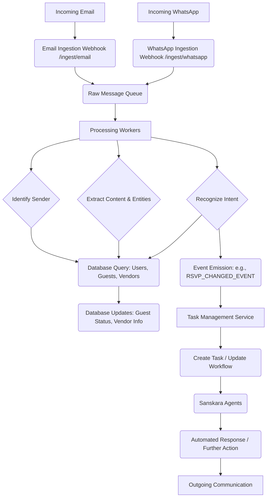

# Comprehensive Plan for Email and WhatsApp Response Handling

## 1. Ingestion: How incoming emails and WhatsApp messages will be received by the system.

*   **Email Ingestion:**
    *   **Approach:** Utilize a dedicated email service provider (ESP) with webhook capabilities (e.g., SendGrid, Mailgun, AWS SES with SNS).
    *   **Mechanism:**
        1.  Configure the ESP to forward incoming emails to a specific endpoint (webhook URL) on our system.
        2.  The webhook endpoint will be a secure API endpoint within the Sanskara application (e.g., `/ingest/email`).
        3.  The ESP will send the full email content (headers, body, attachments) as a POST request to this endpoint.
    *   **Considerations:**
        *   Dedicated email addresses for guests (e.g., `rsvp@yourwedding.com`) and vendors (e.g., `vendors@yourwedding.com`) for clear routing.
        *   Authentication/Authorization for webhooks to ensure requests originate from the trusted ESP.
        *   Handling various email formats (plain text, HTML).

*   **WhatsApp Ingestion:**
    *   **Approach:** Leverage Twilio's WhatsApp API, which provides robust webhook functionality.
    *   **Mechanism:**
        1.  Configure a Twilio WhatsApp number to send incoming messages to a webhook URL on our system (e.g., `/ingest/whatsapp`).
        2.  Twilio will send message details (sender, content, media URLs) as a POST request to this endpoint.
    *   **Considerations:**
        *   Twilio's API handles message encryption and delivery.
        *   Need to manage Twilio account and credentials securely.
        *   Handling different message types (text, images, documents).

## 2. Processing: How the content of these messages will be processed.

*   **Centralized Message Queue:**
    *   **Technology:** RabbitMQ, Apache Kafka, or AWS SQS.
    *   **Mechanism:** Upon successful ingestion by the webhook endpoints, the raw email/WhatsApp message data will be immediately published to a dedicated message queue (e.g., `incoming_messages_queue`). This decouples ingestion from processing, ensuring durability and scalability.

*   **Processing Service (Asynchronous Workers):**
    *   **Architecture:** A separate microservice or set of worker processes will consume messages from the `incoming_messages_queue`.
    *   **Steps:**
        1.  **Sender Identification:**
            *   Extract sender's email address (from email) or phone number (from WhatsApp).
            *   Query the database (`users` and `guest_list` tables, potentially `user_shortlisted_vendors`) to identify if the sender is an existing guest, vendor, or system user.
            *   If not found, flag as an unknown sender for further action.
        2.  **Content Extraction:**
            *   Extract plain text content from email bodies (strip HTML).
            *   Retrieve and process any attachments (e.g., store in S3, scan for malware).
        3.  **Intent Recognition & Entity Extraction (NLP):**
            *   **Technology:** Natural Language Processing (NLP) models (e.g., Google's Gemini API, spaCy, NLTK).
            *   **Mechanism:**
                *   Use NLP to classify the message intent (e.g., RSVP change, question about venue, vendor inquiry, general feedback).
                *   Extract key entities: guest names, RSVP status (Yes/No/Maybe, number of attendees), dates, times, specific questions, vendor names, contact details.
                *   Leverage existing `supabase_memory_service.py` for semantic search against historical conversations or known wedding details to improve context and accuracy of NLP.
        4.  **Data Structuring:** Convert extracted information into a standardized, structured format (e.g., JSON object) for easier database integration.

## 3. Database Integration: How extracted information will be used to update the database.

*   **Service Layer:** A dedicated service layer will handle all database interactions, utilizing the existing `sanskara/sanskara/db_queries.py` for SQL operations and `sanskara/sanskara/memory/supabase_memory_service.py` for memory/embedding updates.
*   **Update Mechanisms:**
    *   **Guest Information Updates:**
        *   If intent is "RSVP change," use `update_guest_status_query` to change guest status (e.g., 'Confirmed', 'Declined').
        *   If new contact details or dietary requirements are identified, use relevant update queries (e.g., `update_guest_query` if available, or extend `db_queries.py`).
        *   If a new guest is identified (e.g., "I'm bringing a plus one named John Doe"), use `create_guest_query`.
    *   **Vendor Information Updates:**
        *   If a vendor provides updated contact info, use `update_user_shortlisted_vendor_query`.
        *   If a new vendor inquiry, potentially use `create_user_shortlisted_vendor_query` to add to a pending list.
    *   **Chat History/Context:** Store the raw message and processed intent/entities in a `communications_log` or `message_history` table, linking it to the relevant `wedding_id`, `guest_id`, or `vendor_id`. This can inform future NLP processing via the `supabase_memory_service`.
    *   **Task/Job Creation:** Information requiring further action will trigger the job creation mechanism (see section 4).

## 4. Job Creation/Triggering: How responses that require further action lead to new tasks or trigger existing workflows.

*   **Event-Driven Architecture:** The processing service will emit specific events based on the recognized intent and extracted data.
*   **Task Management Service:**
    *   **Technology:** Celery (Python), Apache Airflow, or a simple internal job scheduler.
    *   **Mechanism:**
        1.  **Event Listeners:** The task management service will listen for events from the processing service (e.g., `RSVP_CHANGED_EVENT`, `VENDOR_QUESTION_EVENT`, `NEW_CONTACT_EVENT`).
        2.  **Task Creation:**
            *   For an RSVP change: Create an internal task using `create_task_query` (e.g., "Review RSVP change for [Guest Name]").
            *   For a vendor question: Create a task for the appropriate agent (e.g., "Respond to [Vendor Name]'s question about [Topic]").
            *   For new contact details: Create a task to verify and update records.
        3.  **Workflow Triggering:**
            *   If the message relates to an ongoing workflow (e.g., "I need to change my menu choice" in a "Menu Selection" workflow), the task management service will:
                *   Retrieve the relevant workflow using `get_workflow_by_name_query`.
                *   Update the workflow status if necessary using `update_workflow_status_query`.
                *   Create a specific task within that workflow.
        4.  **Agent Invocation:** For complex interactions, the task management service can directly invoke relevant Sanskara agents (e.g., `guest_and_communication_agent`, `vendor_management_agent`) with the extracted context to generate automated responses or perform complex actions.

### Mermaid Diagram: Message Flow



## 5. Error Handling & Logging: How errors in message processing or database updates will be handled and logged.

*   **Logging:**
    *   **Centralized Logging:** Implement structured logging using a library like `Loguru` or Python's `logging` module, with output directed to a centralized logging system (e.g., ELK Stack, Datadog, CloudWatch Logs).
    *   **Granularity:** Log at different levels (INFO for successful processing, WARNING for minor issues, ERROR for critical failures, DEBUG for development).
    *   **Contextual Information:** Include relevant message IDs, sender details, timestamps, and processing stage in logs to aid debugging.
    *   **Example Log Entry:**
        ```json
        {
          "timestamp": "2025-07-30T10:00:00Z",
          "level": "ERROR",
          "service": "message_processor",
          "message": "Failed to update guest status",
          "error_type": "DatabaseError",
          "details": "Could not connect to Supabase",
          "message_id": "email_abc123",
          "sender": "guest@example.com",
          "wedding_id": "uuid-12345"
        }
        ```

*   **Error Handling:**
    *   **Ingestion Layer:**
        *   **Webhook Retries:** ESPs/Twilio typically have built-in retry mechanisms for failed webhook deliveries.
        *   **Dead-Letter Queue (DLQ):** Messages that fail to be processed after multiple retries from the main queue should be moved to a DLQ.
    *   **Processing Layer:**
        *   **Try-Except Blocks:** Use comprehensive `try-except` blocks around all critical operations (NLP calls, database writes).
        *   **Specific Exception Handling:** Catch specific exceptions (e.g., `DatabaseError`, `NLPProcessingError`, `InvalidMessageFormat`) and handle them gracefully.
        *   **Partial Failures:** If only a part of the processing fails (e.g., NLP fails but sender identified), log the specific failure and proceed with available information, if possible.
        *   **Retry Logic:** Implement exponential backoff and retry mechanisms for transient errors (e.g., temporary database connection issues).
    *   **Alerting:**
        *   Integrate with an alerting system (e.g., PagerDuty, Slack, email) to notify administrators of critical errors (e.g., persistent processing failures, DLQ buildup).
    *   **Monitoring:**
        *   Track key metrics: number of messages ingested, processed, failed; processing latency; DLQ size. Use tools like Prometheus/Grafana or cloud-native monitoring services.

### Mermaid Diagram: Error Handling & Logging

```mermaid
graph TD
    A[Ingestion Webhook] --> B{Publish to Message Queue};
    B -- Failure --> C(Retry Logic);
    C -- Persistent Failure --> D[Dead Letter Queue];
    B --> E[Processing Worker];
    E -- Success --> F[Database/Task Update];
    E -- Processing Error --> G(Error Handling Logic);
    G --> H[Log Error];
    G --> I(Alerting System);
    G --> J(Monitoring Metrics);
    F -- DB Error --> G;
    D --> K[Manual Review / Re-processing];