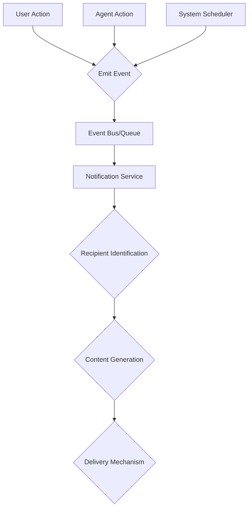
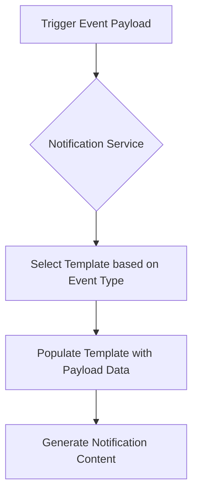
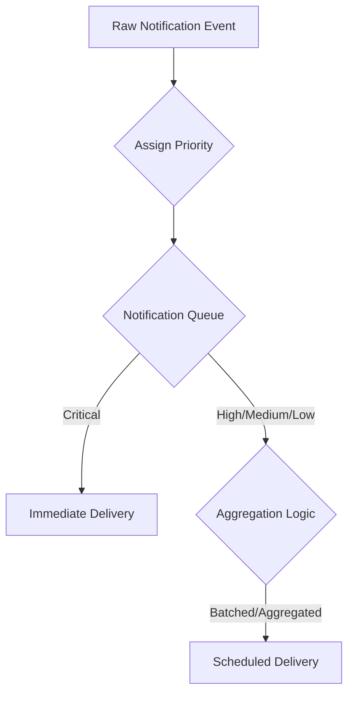
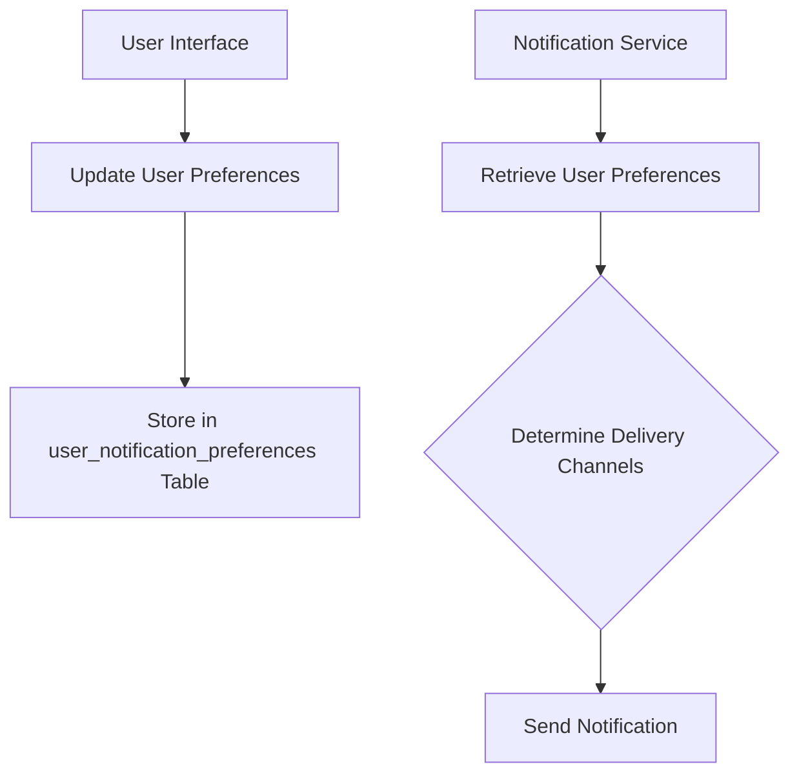

# Comprehensive Plan for Notification Management in Sanskara AI

This document outlines a comprehensive plan for implementing a robust notification management system within the Sanskara AI platform. It addresses recipient identification, trigger events, content generation, delivery mechanisms, prioritization, user preferences, database integration, and integration with the main agent.

## 1. Recipient Identification

**Objective:** Define how notification recipients will be identified and managed within the Sanskara AI system.

**Approach:**

*   **User Roles & Wedding Members:** Leverage the existing `users` and `wedding_members` tables. Notifications can be sent to specific users (`user_id`), to all members of a `wedding_id` (e.g., bride, groom, planner), or to specific roles within a wedding (e.g., only "planners" for a specific wedding).
*   **External Parties:** For external parties (e.g., vendors, guests), their `contact_info` (email, phone number) stored in relevant tables (e.g., `user_shortlisted_vendors`, `guest_list`) will be used.
*   **Internal Agents:** Notifications to internal agents (e.g., `OrchestratorAgent`, sub-agents) will be handled through internal messaging queues or system logs, not external delivery mechanisms.
*   **Recipient Mapping Service:** Implement a dedicated service or function that, given a context (e.g., `wedding_id`, `task_id`, `event_type`), can resolve the list of `user_id`s, `email` addresses, or `phone_number`s that should receive the notification. This service will query the database based on predefined rules.

**Data Structures:**

*   No new tables are strictly required for recipient identification itself, as existing tables like `users`, `wedding_members`, `user_shortlisted_vendors`, and `guest_list` contain the necessary information.
*   Consider adding a `notification_preferences` table (detailed later) to store user-specific communication preferences.

**Example Logic:**

*   To notify wedding members of a new task: Query `wedding_members` for all `user_id`s associated with the `wedding_id`.
*   To notify a guest about RSVP changes: Use the `contact_info` from the `guest_list` table.
*   To notify a vendor about booking confirmation: Use `contact_info` from `user_shortlisted_vendors`.

## 2. Trigger Events

**Objective:** Identify the key events or actions within the Sanskara AI system that should automatically trigger notifications.

**Approach:**

*   **Event-Driven Architecture:** Adopt an event-driven approach where specific actions emit events, and a notification service subscribes to these events. This decouples event generation from notification sending.
*   **Categorization of Events:**
    *   **User-initiated Actions:**
        *   New user registration (to admin/onboarding agent)
        *   Guest RSVP change (`guest_list` status update)
        *   User preference changes
        *   New message from user (to agent)
        *   Task completion by user (if applicable)
    *   **Agent-initiated Actions:**
        *   New task assigned/created (`tasks` table insert)
        *   Task status change (`tasks` table update)
        *   Wedding detail changes (e.g., date, location update in `weddings` table)
        *   New budget item created/updated (`budget_items` table insert/update)
        *   Vendor shortlisted/booked (`user_shortlisted_vendors` insert/update)
        *   Workflow status change (`workflows` table update)
        *   Agent requires user input/clarification
    *   **System-triggered Events:**
        *   Upcoming deadlines (e.g., task due dates, event dates from `timeline_events`)
        *   Low budget alerts
        *   New system updates/features

**Implementation Considerations:**

*   **Event Bus/Queue:** Use a lightweight event bus or message queue (e.g., Redis Pub/Sub, a simple in-memory queue for initial implementation, or a more robust solution like Kafka/RabbitMQ for scalability) to handle event propagation. This ensures that notification generation doesn't block the primary business logic.
*   **Hooking into Existing Logic:** Integrate event emission directly into the relevant service functions (e.g., after `create_task_query` in `db_queries.py`, an event `task_created` is emitted).
*   **Event Schema:** Define a clear schema for each event type, including:
    *   `event_type`: (e.g., `task_created`, `guest_rsvp_updated`)
    *   `timestamp`: When the event occurred
    *   `initiator_id`: `user_id` or `agent_id`
    *   `wedding_id`: Context for the event
    *   `payload`: Relevant data related to the event (e.g., `task_id`, `guest_id`, `new_status`, `changed_fields`). This payload will be crucial for dynamic notification content.

**Mermaid Diagram for Event Flow:**



## 3. Notification Content

**Objective:** Define what information should be included in a notification and how the content can be dynamic and relevant to the trigger event.

**Approach:**

*   **Templating Engine:** Utilize a templating engine (e.g., Jinja2 for Python) to create flexible notification templates. This allows for dynamic insertion of data based on the triggered event.
*   **Contextual Data Inclusion:** The `payload` from the trigger event (as defined in Section 2) will provide the necessary data to populate the templates.
*   **Content Types:**
    *   **Concise Summaries:** For in-app and push notifications, keep messages brief and actionable.
    *   **Detailed Information:** For email and potentially WhatsApp messages, provide more comprehensive details, including links to relevant sections within the application.
    *   **Actionable Elements:** Include clear calls to action (CTAs) within notifications where appropriate (e.g., "Review Task," "RSVP Now," "View Vendor Details").
*   **Internationalization (i18n):** Consider supporting multiple languages for notification content, especially for user-facing notifications.
*   **Personalization:** Address recipients by name where possible. Tailor the tone and content based on user roles (e.g., a notification to a wedding planner might be more technical than one to a guest).

**Example Templates:**

*   **Task Created Notification:**
    *   Subject: `New Task Assigned: {{task_title}}`
    *   Body: `Hi {{recipient_name}}, a new task "{{task_title}}" has been assigned to you for the wedding of {{wedding_name}}. Description: {{task_description}}. Due Date: {{task_due_date}}. [View Task](link_to_task)`
*   **Guest RSVP Update Notification:**
    *   Subject: `RSVP Update for {{guest_name}}`
    *   Body: `{{guest_name}} has updated their RSVP status to {{new_rsvp_status}} for {{wedding_name}}. Dietary Requirements: {{dietary_requirements}}. [View Guest List](link_to_guest_list)`
*   **Vendor Shortlisted Notification (to Agent):**
    *   Subject: `New Vendor Shortlisted for {{wedding_name}}`
    *   Body: `User has shortlisted {{vendor_name}} ({{vendor_category}}) for {{wedding_name}}. Contact Info: {{contact_info}}. [View Vendor Details](link_to_vendor)`

**Mermaid Diagram for Content Generation:**



## 4. Delivery Mechanisms

**Objective:** Define how notifications will be delivered, leveraging existing tools and considering potential new ones.

**Approach:**

*   **Multi-channel Delivery:** Support various delivery channels to cater to different user preferences and notification types.
*   **Existing Tools Integration:**
    *   `send_email`: Utilize this for formal notifications, summaries, and content that requires rich formatting. This would be suitable for general updates, task assignments, and important alerts.
    *   `send_whatsapp_message`: Leverage this for timely, concise, and conversational notifications, especially for guests and quick updates. This is ideal for RSVP confirmations, event reminders, or immediate alerts.
*   **New Delivery Mechanisms (Future Considerations):**
    *   **In-app Notifications:** A dedicated notification center within the Sanskara AI web/mobile application for real-time alerts, system messages, and a historical log of notifications. This would be the primary channel for user-facing, non-critical updates.
    *   **Push Notifications:** For mobile applications, push notifications can provide immediate alerts even when the app is not actively in use.
    *   **SMS:** As a fallback for critical notifications if other channels are unavailable or not preferred by the user.
*   **Abstraction Layer:** Implement an abstraction layer for sending notifications. This "Notification Sender" service would receive the fully rendered notification content and the recipient's contact information, then decide which specific delivery tool to use based on the channel specified (and user preferences, if available).

**Integration with Existing Tools:**

The existing `send_email` and `send_whatsapp_message` tools would be wrapped or called by the Notification Sender service.

*   `send_email(recipient_email, subject, body)`
*   `send_whatsapp_message(recipient_phone_number, message_body)`

**Workflow:**

1.  Notification Service receives generated content and recipient details.
2.  It consults user preferences (if available) to determine preferred channels.
3.  For each channel, it calls the appropriate sender (e.g., `send_email`, `send_whatsapp_message`, or an in-app notification handler).

**Mermaid Diagram for Delivery Flow:**

```mermaid
graph TD
    A[Generated Notification Content] --> B{Notification Sender Service};
    B --> C{Check User Preferences};
    C --> D{Email Sender (send_email)};
    C --> E{WhatsApp Sender (send_whatsapp_message)};
    C --> F{In-app Notification Handler};
    C --> G{Push Notification Service};
    D --> H[Email Delivered];
    E --> I[WhatsApp Message Delivered];
    F --> J[In-app Notification Displayed];
    G --> K[Push Notification Delivered];
```

## 5. Prioritization & Aggregation

**Objective:** Define how notifications will be prioritized and if there is a need for aggregating similar notifications to avoid spamming users.

**Approach:**

*   **Prioritization Levels:** Assign priority levels to notifications based on their urgency and importance.
    *   **Critical:** Immediate action required (e.g., security alerts, system failures, urgent requests from agents). Delivered via all available channels, potentially bypassing user preferences for immediate delivery.
    *   **High:** Important information requiring timely attention (e.g., new task assignments, major wedding detail changes, RSVP updates). Delivered via preferred channels.
    *   **Medium:** General updates and informational messages (e.g., budget updates, vendor shortlisted). Delivered via preferred channels, potentially batched.
    *   **Low:** Promotional or background information (e.g., weekly summaries, system tips). Can be batched and delivered less frequently.
*   **Aggregation Strategies:**
    *   **Time-based Aggregation (Batching):** For low and medium priority notifications, collect multiple notifications over a period (e.g., hourly, daily) and send them as a single digest. This is particularly useful for in-app notifications and email summaries.
    *   **Type-based Aggregation:** Group similar notifications together (e.g., "3 new guests RSVP'd" instead of 3 separate notifications).
    *   **Smart Aggregation:** Use AI/ML to identify patterns and intelligently group notifications that are semantically similar or relate to the same context, even if they are of different types. This would require more advanced processing.
*   **User-configurable Aggregation:** Allow users to define their own aggregation preferences (e.g., "send daily digest of budget updates").

**Implementation Considerations:**

*   **Notification Queue with Priority:** Implement a queue system that processes notifications based on priority. Critical notifications are processed immediately, while lower priority ones can be delayed or batched.
*   **Aggregation Logic:** Develop specific logic for each type of aggregation. This might involve:
    *   A temporary storage for notifications awaiting aggregation.
    *   Rules to determine when a batch is complete (e.g., time elapsed, number of notifications reached).
    *   A process to combine content from multiple notifications into a single, coherent message.

**Mermaid Diagram for Prioritization & Aggregation:**



## 6. User Preferences

**Objective:** Define how users can manage their notification preferences (e.g., opt-in/out of certain types, choose delivery methods).

**Approach:**

*   **Dedicated User Interface (UI):** Provide a clear and intuitive UI within the Sanskara AI application where users can configure their notification settings.
*   **Granular Control:** Allow users to:
    *   **Opt-in/out of notification categories:** (e.g., "Task Updates," "Budget Alerts," "Guest RSVPs").
    *   **Choose preferred delivery channels per category:** (e.g., "Email for Budget Alerts, In-app for Task Updates, WhatsApp for Guest RSVPs").
    *   **Set aggregation preferences:** (e.g., "Daily digest for low-priority notifications").
    *   **Silence notifications for a period:** (e.g., "Do Not Disturb" mode).
*   **Default Preferences:** Establish sensible default notification preferences for new users to ensure they receive essential updates without being overwhelmed.
*   **Preference Storage:** Store user preferences in a dedicated database table.

**Database Schema Suggestion for `user_notification_preferences` table:**

| Column Name            | Data Type | Description                                        |
| :--------------------- | :-------- | :------------------------------------------------- |
| `preference_id`        | UUID      | Primary key                                        |
| `user_id`              | UUID      | Foreign key to `users` table                       |
| `notification_type`    | TEXT      | Category of notification (e.g., 'task_update', 'budget_alert') |
| `channel_email`        | BOOLEAN   | True if email is enabled for this type             |
| `channel_whatsapp`     | BOOLEAN   | True if WhatsApp is enabled for this type          |
| `channel_in_app`       | BOOLEAN   | True if in-app is enabled for this type            |
| `channel_push`         | BOOLEAN   | True if push is enabled for this type              |
| `aggregation_setting`  | TEXT      | 'immediate', 'daily', 'weekly', etc.              |
| `created_at`           | TIMESTAMP | Timestamp of creation                              |
| `updated_at`           | TIMESTAMP | Timestamp of last update                           |

**Integration with Notification Service:**

The Notification Service (from Section 4) will query this `user_notification_preferences` table before sending any notification to a user. If a user has opted out of a specific notification type or channel, the notification will not be sent via that channel.

**Mermaid Diagram for User Preference Flow:**



## 7. Database Integration

**Objective:** Define how notification states (sent, read, dismissed) will be stored and managed in the database, referring to `sanskara/sanskara/db_queries.py` and `sanskara/sanskara/memory/supabase_memory_service.py` for potential integration points.

**Approach:**

*   **New `notifications` Table:** Create a central `notifications` table to store all generated notifications, regardless of their delivery status. This table will serve as a single source of truth for all notifications and will facilitate in-app notification display and historical tracking.
*   **Notification State Tracking:** The `notifications` table will track the state of each notification (e.g., `pending`, `sent`, `read`, `dismissed`, `failed`).
*   **Integration with `db_queries.py`:** New functions will be added to `db_queries.py` to handle CRUD operations for the `notifications` table and the `user_notification_preferences` table (as suggested in Section 6).
*   **No Direct Integration with `supabase_memory_service.py`:** The `supabase_memory_service.py` is primarily for agent memory and conversation history, using embeddings. Notification data, while potentially contextual, is not directly part of the agent's conversational memory in the same way. Therefore, direct integration is not recommended. Notifications are structured events, not conversational turns.

**Database Schema Suggestion for `notifications` table:**

| Column Name            | Data Type | Description                                        |
| :--------------------- | :-------- | :------------------------------------------------- |
| `notification_id`      | UUID      | Primary key                                        |
| `wedding_id`           | UUID      | Foreign key to `weddings` table (optional, but highly recommended for context) |
| `recipient_user_id`    | UUID      | Foreign key to `users` table (for internal users) |
| `recipient_contact`    | TEXT      | Email/phone for external recipients                |
| `notification_type`    | TEXT      | Category of notification (e.g., 'task_update')     |
| `subject`              | TEXT      | Notification subject/title                         |
| `body`                 | TEXT      | Full notification content                          |
| `payload`              | JSONB     | Original event payload for context/re-rendering    |
| `priority`             | TEXT      | 'critical', 'high', 'medium', 'low'                |
| `status`               | TEXT      | 'pending', 'sent', 'read', 'dismissed', 'failed'   |
| `delivery_channel`     | TEXT      | 'email', 'whatsapp', 'in_app', 'push', etc.        |
| `sent_at`              | TIMESTAMP | Timestamp when notification was sent               |
| `read_at`              | TIMESTAMP | Timestamp when notification was read (for in-app)  |
| `created_at`           | TIMESTAMP | Timestamp of creation                              |
| `updated_at`           | TIMESTAMP | Timestamp of last update                           |

**New Queries in `db_queries.py`:**

*   `create_notification_query(wedding_id, recipient_user_id, recipient_contact, notification_type, subject, body, payload, priority, delivery_channel)`
*   `update_notification_status_query(notification_id, status, read_at)`
*   `get_notifications_by_user_id_query(user_id, filters)`
*   `create_user_notification_preference_query(...)`
*   `update_user_notification_preference_query(...)`
*   `get_user_notification_preferences_query(user_id)`

**Mermaid Diagram for Database Integration:**

```mermaid
graph TD
    A[Notification Generation] --> B[Create Notification Record];
    B --> C[notifications Table];
    D[User Action (e.g., read)] --> E[Update Notification Status];
    E --> C;
    F[User Settings UI] --> G[Update User Preferences];
    G --> H[user_notification_preferences Table];
    I[Notification Service] --> J[Query user_notification_preferences];
    J --> H;
```

## 8. Integration with Main Agent

**Objective:** Define how the main `sanskara/sanskara/agent.py` can leverage this notification system.

**Approach:**

*   **Agent-as-Notifier:** The main `OrchestratorAgent` and its sub-agents should be able to trigger notifications as part of their operational flow. This means providing them with a standardized way to "request" a notification.
*   **Notification Tool:** Introduce a new tool, `send_notification`, accessible to the agents. This tool would encapsulate the complexity of the notification system (recipient identification, content generation, delivery).
*   **Tool Parameters:** The `send_notification` tool would take parameters such as:
    *   `event_type`: (e.g., `task_completed`, `guest_rsvp_changed`) - maps to predefined event types.
    *   `wedding_id`: Context for the notification.
    *   `recipient_type`: (e.g., `user`, `wedding_member`, `guest`, `vendor`, `internal_agent`)
    *   `recipient_identifier`: The ID or contact info of the specific recipient (e.g., `user_id`, `guest_email`).
    *   `payload`: A dictionary containing dynamic data relevant to the `event_type` (e.g., `{"task_title": "...", "new_status": "..."}`).
*   **Agent's Role in Notification:**
    *   **Triggering:** Agents will call `send_notification` when a relevant event occurs.
    *   **Context Provision:** Agents will provide the necessary `wedding_id` and `payload` to the `send_notification` tool.
    *   **Decision Making (Optional):** For more advanced scenarios, agents could potentially decide *whether* to send a notification based on their reasoning, rather than always sending one for every event. This would involve incorporating notification logic into the agent's prompt or tools.
*   **Decoupling:** The agent itself should not be responsible for the actual sending of notifications (i.e., it shouldn't directly call `send_email` or `send_whatsapp_message`). It should delegate this responsibility to the dedicated Notification Service via the `send_notification` tool. This maintains separation of concerns.

**Example Agent Usage:**

```python
# Inside an agent's tool or response generation logic
await self.call_tool(
    "send_notification",
    event_type="task_completed",
    wedding_id=current_wedding_id,
    recipient_type="wedding_member",
    recipient_identifier="all", # Example: notify all wedding members
    payload={
        "task_title": "Book Photographer",
        "completed_by": "User A",
        "completion_date": "2024-07-30"
    }
)
```

**Mermaid Diagram for Agent Integration:**

```mermaid
graph TD
    A[Agent Logic] --> B[Call send_notification Tool];
    B --> C[Notification Service (via API/Queue)];
    C --> D[Recipient Identification];
    D --> E[Content Generation];
    E --> F[Delivery Mechanisms];